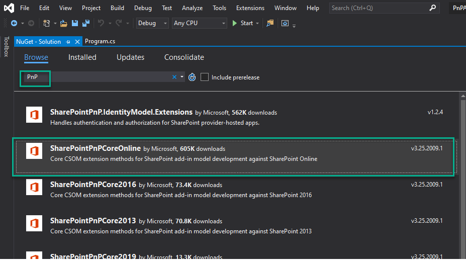

# SharePoint Online Authentication. Modern Authentication
Many SharePoint Online tenants do not allow legacy authentication for security reasons. As a result, developers must use an alternative authetnication method that involves using GetWebLoginClientContext method (see below). 

You can use this project as a demo and a starting point

## How to start from scratch
- Open Visual studio
- Create a new .NET project using .NET framework 4.5 or later. The latest version is recommended.
- add Nuget Package with the name `SharePointPnPCoreOnline`. Note that you might need to select an older version if your current .NET framework version is old.



Add the following code to authenticate with SharePoint Online:

```
class Program
    {
        static void Main(string[] args)
        {
            string siteUrl = "https://contoso.sharepoint.com/sites/GradyTeam";
            var authManager = new AuthenticationManager();
            var ctx =  authManager.GetWebLoginClientContext(siteUrl, null);
            Console.WriteLine($"Success! Connected to SharePoint Online");
            Web web = ctx.Web;
            ctx.Load(web, w => w.Title);
            ctx.ExecuteQuery();            
            Console.WriteLine($"Web site title is '{web.Title}'");
        }
    }
```
